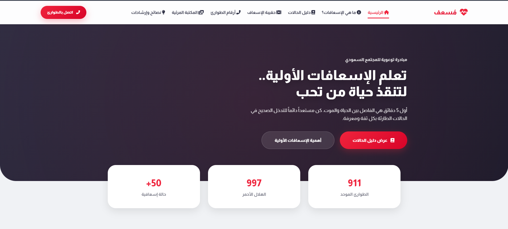
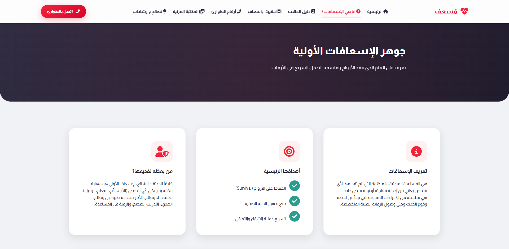
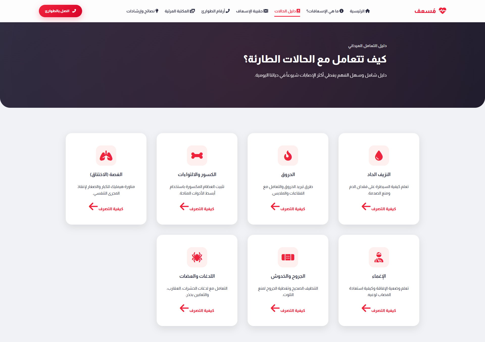
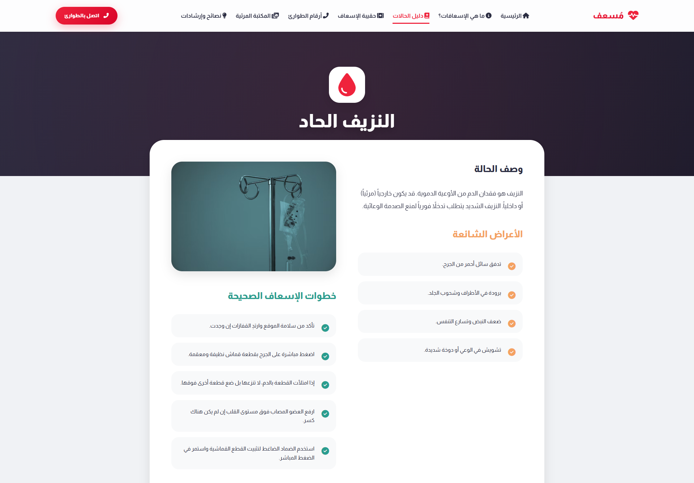
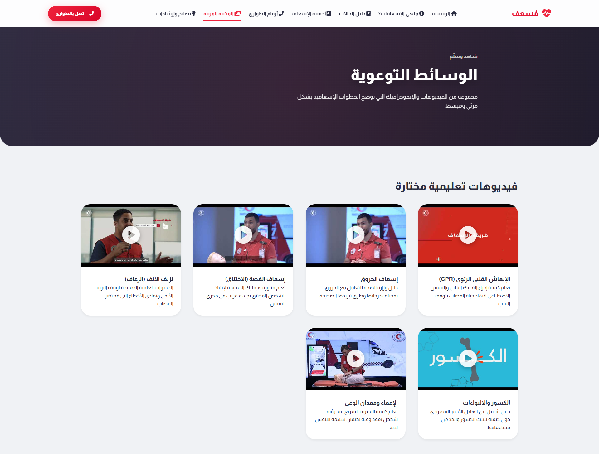

# Aid Site (Mus'ef) 🚑

[**Switch to Arabic Version (README.md)**](README_AR.md)

**Mus'ef** is a technical awareness initiative aimed at spreading first aid culture and providing the community with the necessary knowledge to handle emergency situations with confidence and professionalism.

---

## 🌟 Features

*   **Emergency Cases Guide:** Detailed explanation of over 50 cases (bleeding, burns, fractures, choking, etc.) with practical steps.
*   **Visual Library:** Carefully selected instructional videos from reliable sources like the Saudi Red Crescent and the Ministry of Health.
*   **Emergency Numbers:** Quick access to essential emergency numbers (911, 997).
*   **First Aid Kit:** Interactive list of ideal kit components and how to use them.
*   **Responsive Design:** Smooth user experience on all devices (mobile, tablet, desktop) with a smart side-drawer.
*   **Tips and Guidance:** A dedicated section to correct misconceptions and provide preventive advice.

## 🛠️ Technologies Used

*   **HTML5 & Semantic HTML**: For structure and SEO standards.
*   **Vanilla CSS3**: For a premium look using Glassmorphism and Responsive Design techniques.
*   **JavaScript (ES6)**: For business logic, video playback, and dynamic menu management.
*   **Font Awesome**: For interactive icons.
*   **Google Fonts**: Almarai font for elegant Arabic typography.

## 🚀 Live Demo

Browse the site live at [GitHub Pages](https://limbonux.github.io/aid-site/).

---

## 📸 Project Showroom

| Home Page | Core of First Aid | Cases Directory |
|:---:|:---:|:---:|
|  |  |  |

| Case Details | Emergency Numbers | Awareness Media |
|:---:|:---:|:---:|
|  |  |  |

---

### 🛡️ Disclaimer
The information provided on this site is for educational and awareness purposes only and is not a substitute for calling emergency services or consulting a specialist when necessary.
